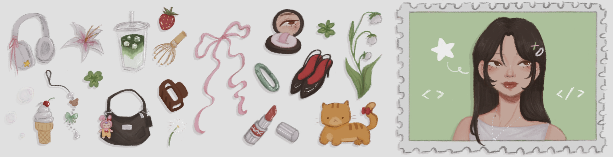

# [;I'm+Jasmine!+%CB%96+.%DD%81+%F0%9D%9C%97%F0%9D%9C%9A.+%E2%82%8A)](https://git.io/typing-svg)

</img>

## ☘️ About Me
I'm Jasmine Tu, an aspiring software developer from De Anza College who loves building impactful and empathetic experiences.

I specialize in combining my technical and creative skills across full-stack development, UI/UX design, and game development. As a project leader, I've taken on multiple roles in engineering, project management, and design. I thrive in collaborative environments, always ensuring the team delivers a polished, meaningful product. 

I'm endlessly curious and committed to building with purpose and passion. Thanks for visiting! 🌸

## 🌷 Tech Stack
- **Languages**:

   

- **Frameworks/Libraries**:

   

- **Design Tools**:

   
  
  

- **IDEs/Engines**:

   

- **Other Tools & Services**:

   
  
  
  
    

## 🧸 Some Projects
### [Multi-Agent, Microservices-based Vulnerability Scanner for GCP Projects](https://github.com/jasminetntu/multiagent-security-gcp)
> Google Cloud Internship | _Tech Stack: Google Agent Development Kit, Google Cloud Functions, Python, Javascript, Node.js_
- An agent-powered solution that automates security scans and support ~25 GCP services, drastically simplifying deployment and execution.
- Streamlined security workflow by refactoring legacy code and building a natural language Q&A interface to interpret scan results, reducing manual security analysis time by over 90% for Technical Account Managers @ Google Cloud.

### [Before I Go](https://github.com/jasminetntu/before-i-go)
> De Anza Game Jam Spring 2025 | _Tech Stack: GameMaker Studio_
   - Won **1st place** out of **40+** teams and **140+** participants through community voting based on the theme: _Not Enough Time_.
   - A 2D, pixel-style visual novel following a terminally ill patient with branching dialogue system, point system, and different endings for each character.

### [Draftly](https://github.com/WangRyan408/Draft.ly)
> Hack for Humanity 2025 @ SCU | _Tech Stack: Figma, HTML/CSS, Javascript, React.js, Node.js_
   - Designed & built a full-stack, user-friendly web application to help applicants tailor their resumes to specific job descriptions.
   - Integrated OpenAI API to intelligently analyze and select the most relevant information for the target role, returning a downloadable PDF file.

## 💌 Things I Love
- Illustration & animation, graphic & UI/UX design
- Exploring new cultures, fashion, and foods
- Collecting trinkets, appreciating nature
- Spreading love & staying curious!

## 🫧 Contact Me!
</img> [*&nbsp;in/jasminetntu/*](https://www.linkedin.com/in/jasminetntu/) 
&nbsp;&nbsp;&nbsp;
</img> &nbsp;*jasminetntu@gmail.com*

<!--
**jasminetntu/jasminetntu** is a ✨ _special_ ✨ repository because its `README.md` (this file) appears on your GitHub profile.

Here are some ideas to get you started:

- 🔭 I’m currently working on ...
- 🌱 I’m currently learning ...
- 👯 I’m looking to collaborate on ...
- 🤔 I’m looking for help with ...
- 💬 Ask me about ...
- 📫 How to reach me: ...
- 😄 Pronouns: ...
- ⚡ Fun fact: ...
-->
